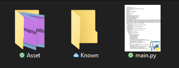

# facerecognition-school-project
This is my first project. It was a school project that makes with my team

## requirement
* Programs that can run code
* python 3.7 or higher
* opencv
* dlib
* face_recognition
* numpy
* Pillow

## if you want to use this facerecognition
1. First of all, Download only folder's name "schoolps" 
2. Then go to make folder name "Known" in schoolps   
3. Run programs
### finish
